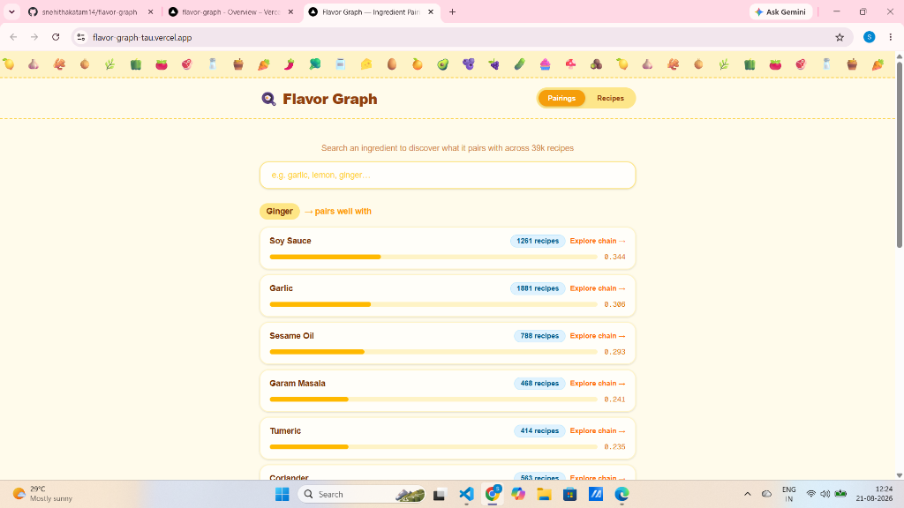
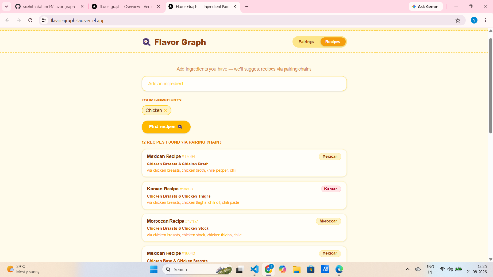

# Flavor Graph

Ingredient pairing explorer built on top of CognoDB. Discovers flavor connections and pairing chains across 39,000 recipes using multi-hop graph traversal.

**Live Demo:** [https://flavor-graph-tau.vercel.app](https://flavor-graph-tau.vercel.app)  
**Repository:** [https://github.com/snehithakatam14/flavor-graph](https://github.com/snehithakatam14/flavor-graph)

---

## Screenshots

| Pairing Explorer | Recipe Finder |
| :---: | :---: |
|  |  |

---

## What it does

- **Direct Flavor Pairings:** Search any ingredient to get pairing recommendations ranked by co-occurrence affinity across 39k culinary recipes.
- **Multi-Hop Traversal (2-Hop Chains):** Explores ingredient chains connected via intermediate bridge ingredients—identifying flavor compatibility even if two ingredients never appear together in the same recipe.
- **Graph-Powered Recipe Discovery:** Input ingredients you have to find recipes matched through flavor pairing neighbors.

---

## Why a Graph Database?

Relational databases structure data in static tables, requiring expensive multi-table self-joins for indirect relationship lookups. In a culinary network, discovering hidden pairings requires traversing multi-step relationship paths.

### 2-Hop Traversal Example

`
(Garlic) ──[:PAIRS_WITH]──> (Ginger) ──[:PAIRS_WITH]──> (Lemongrass)
`

Garlic and lemongrass rarely co-occur in the same dish directly, but both share strong pairing affinity with ginger. In SQL, querying this 2-hop connection requires joining a pairs table onto itself twice with aggregation and deduplication filters. In CognoDB (Cypher), this is expressed as a clean path pattern:

`cypher
MATCH (start:Ingredient {name: })-[:PAIRS_WITH]-(mid:Ingredient)
WITH start, mid LIMIT 8
MATCH (mid)-[:PAIRS_WITH]-(related:Ingredient)
WHERE related.name <> start.name
RETURN DISTINCT related.name AS name
LIMIT 20;
`

---

## Data Model

`
     (:Recipe {recipe_id, name, cuisine})
                      |
                      | [:CONTAINS]
                      v
             (:Ingredient {name})
               /              \
 [:PAIRS_WITH]                  [:PAIRS_WITH]
 {score, count}                 {score, count}
             v                  v
       (:Ingredient)      (:Ingredient)
`

- **Nodes:**
  - Ingredient: Unique normalized ingredient name (3,034 nodes)
  - Recipe: Recipe metadata and cuisine type (39,774 nodes)
- **Relationships:**
  - PAIRS_WITH: Bidirectional weighted edge connecting ingredients based on cosine-lift co-occurrence score (113,633 edges)
  - CONTAINS: Directed edge from Recipe to Ingredient (421,609 edges)

---

## Key Cypher Queries

All queries use parameterized Cypher without string interpolation.

### 1. Direct Pairings
Returns top 15 ingredients that pair with a chosen ingredient, sorted by co-occurrence score:
`cypher
MATCH (i:Ingredient {name: })-[p:PAIRS_WITH]-(other:Ingredient)
RETURN other.name AS name,
       round(p.score * 1000) / 1000 AS score,
       p.shared_recipe_count AS count
ORDER BY p.score DESC
LIMIT 15;
`

### 2. 2-Hop Traversal (Hidden Connections)
Finds indirectly connected ingredients via top bridge nodes:
`cypher
MATCH (start:Ingredient {name: })-[:PAIRS_WITH]-(mid:Ingredient)
WITH start, mid LIMIT 8
MATCH (mid)-[:PAIRS_WITH]-(related:Ingredient)
WHERE related.name <> start.name
RETURN DISTINCT related.name AS name
LIMIT 20;
`

### 3. Recipe Recommendation via Pairings
Finds recipes containing ingredients that pair well with the user\'s pantry items:
`cypher
MATCH (have:Ingredient)-[:PAIRS_WITH]-(sub:Ingredient)
WHERE have.name IN 
WITH sub LIMIT 20
MATCH (sub)<-[:CONTAINS]-(r:Recipe)
WITH r, collect(DISTINCT sub.name) AS matchedVia
RETURN r.name AS name,
       r.cuisine AS cuisine,
       matchedVia,
       size(matchedVia) AS matchCount
ORDER BY matchCount DESC
LIMIT 12;
`

---

## Setup & Running Locally

### 1. Prerequisites
- Node.js 18+
- Python 3.9+ (for data preprocessing)
- CognoDB Cloud instance

### 2. Create CognoDB Instance
1. Log in to [CognoDB Cloud](https://cognodb.com).
2. Create a new database instance.
3. Save your connection credentials (NEO4J_URI, NEO4J_USERNAME, NEO4J_PASSWORD).

### 3. Clone & Install
`ash
git clone https://github.com/snehithakatam14/flavor-graph.git
cd flavor-graph
npm install
`

### 4. Configure Environment Variables
Create a .env.local file in the root directory:
`env
NEO4J_URI=bolt+s://<your-instance>.databases.cognodb.com
NEO4J_USERNAME=neo4j
NEO4J_PASSWORD=<your-password>
`

### 5. Process Dataset & Seed Graph
1. Download the Kaggle Recipe Ingredients Dataset (	rain.json) into data/train.json.
2. Generate node and relationship CSVs:
`ash
python scripts/process_data.py
`
3. Seed the graph into CognoDB:
`ash
node scripts/seed.js
`

### 6. Start the App
`ash
npm run dev
`
Open http://localhost:3000.

---

## Tech Stack

- **Framework:** Next.js 16 (App Router)
- **Database:** CognoDB (Neo4j Bolt Protocol)
- **Driver:** official 
eo4j-driver
- **Styling:** Tailwind CSS
- **Data Ingestion:** Python & Node.js
- **Deployment:** Vercel
